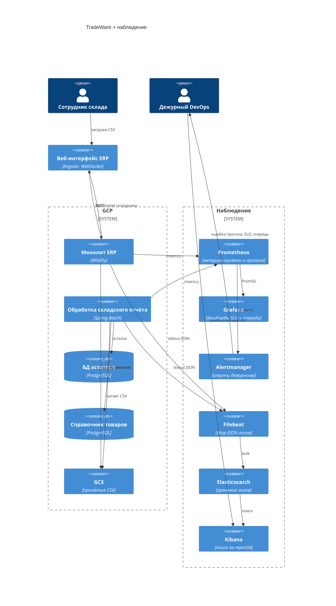

# Task 5. C4 с мониторингом и логированием

Draw.io: [c4-observability.drawio](c4-observability.drawio).

```mermaid
C4Container
    title TradeWare + наблюдение
    Person(wh, "Сотрудник склада")
    Person(ops, "Дежурный DevOps")
    Container(web, "Веб-интерфейс ERP", "Angular, WebSocket")
    System_Boundary(backend, "GCP") {
        Container(monolith, "Монолит ERP", "WildFly")
        Container(batch, "Обработка складского отчёта", "Spring Batch")
        ContainerDb(stock, "БД остатков", "PostgreSQL")
        ContainerDb(ref, "Справочник товаров", "PostgreSQL")
        Container(gcs, "GCS", "принятые CSV")
    }
    System_Boundary(obs, "Наблюдение") {
        Container(prom, "Prometheus", "метрики приёмки и прогона")
        Container(graf, "Grafana", "дашборды SLO и очереди")
        Container(alert, "Alertmanager", "алерты дежурному")
        Container(fb, "Filebeat", "сбор JSON-логов")
        Container(es, "Elasticsearch", "хранение логов")
        Container(kib, "Kibana", "поиск по reportId")
    }
    Rel(wh, web, "загрузка CSV")
    Rel(web, monolith, "REST")
    Rel(monolith, gcs, "принятый отчёт")
    Rel(batch, gcs, "читает CSV")
    Rel(batch, stock, "остатки")
    Rel(batch, ref, "справочник")
    Rel(monolith, prom, "/metrics")
    Rel(batch, prom, "/metrics")
    Rel(prom, graf, "PromQL")
    Rel(prom, alert, "правила")
    Rel(alert, ops, "ошибка прогона, SLO, очередь")
    Rel(monolith, fb, "stdout JSON")
    Rel(batch, fb, "stdout JSON")
    Rel(fb, es, "bulk")
    Rel(es, kib, "поиск")
    Rel(ops, kib, "разбор по reportId")
    Rel(monolith, web, "WebSocket сотруднику")
```
